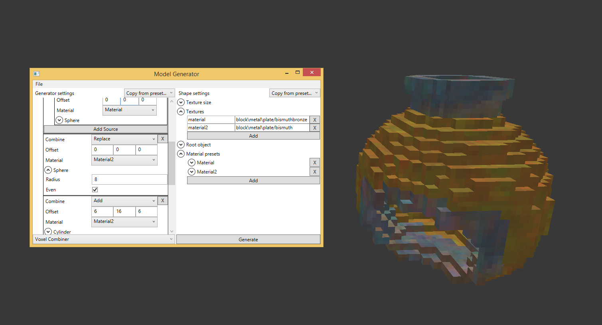

# VSMG
Generator of simple models for VS Model Creator. Creates only basic shapes and assigns uvs and textures, the rest of the refinement is done in VSMC.

### How it works
A generator consists of a main application and generator plug-ins. Dll generators located in the `generators` folder are connected at application start.

In the application you can select a generator and configure it. Additionally you can customize textures and root object. To export the generated model file click "Generate".

There is a lot of metadata in json,since the serializer saves all the fields. So it is recommended to re-save the model through VSMC.

### Sphere generator
It is possible to choose:
- Radius
- Even
- Offset
The first texture is selected.
An additional option is a hollow sphere, you can choose an inner radius.

### Cylinder generator
Compared to the sphere, 2 more parameters are added:
- Length
- Vertical axis
It also has a hollow version (i.e. a pipe).

### Custom generators
WPF is used for UI. The generator must be marked with the `ShapeGenerator(...)` attribute and inherit from `IShapeGenerator`.

When the generator is selected `ShowPanel(Panel parent)` is called. You can add the necessary controls to the `parent`. When switching to another generator `OnHide()` will be called.

When the `Generate` button is pressed the `Generate(Shape shape)` method will be called. You can add any parameters to the shape. When the method is called there are already texture settings there. If root was enabled all shape elements will be moved in root before export.

To add your own generator just drop the dll into the `generators` folder.

## TODOs
- Add element and face parameters like render-pass and glow
- Make saveable presets
